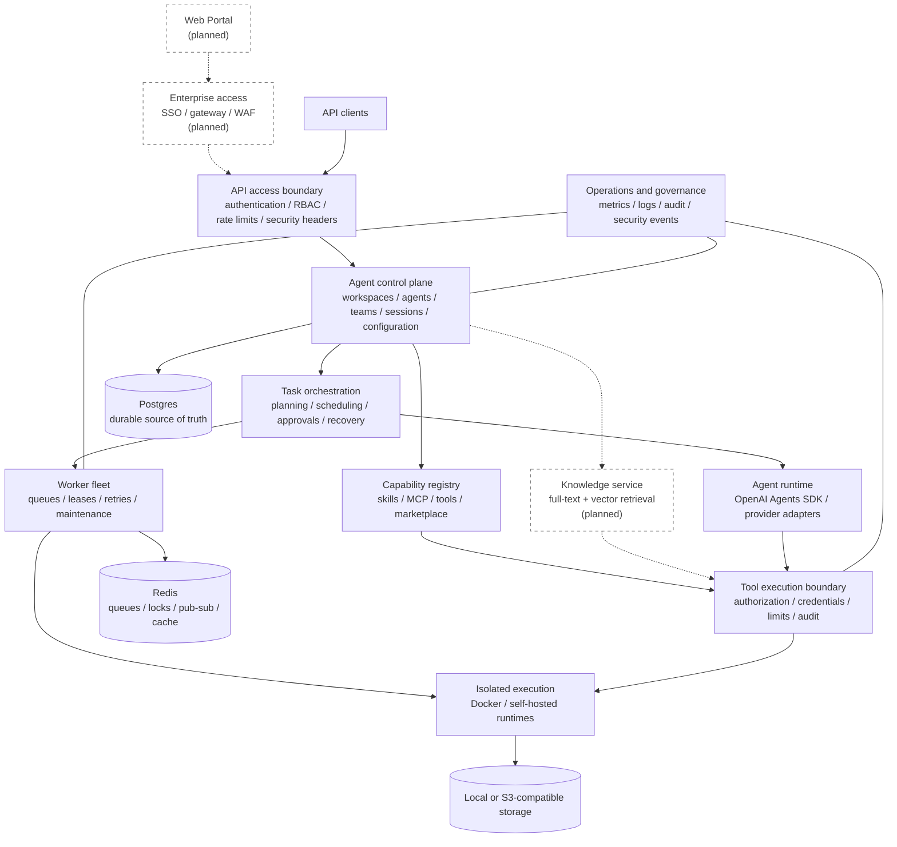

# OpsMesh

Open-source enterprise agent framework for building, operating, and governing teams of AI agents.

OpsMesh is a backend framework and control plane for organizations that need more than a chat
wrapper. It provides durable task orchestration, workspace isolation, capability governance,
human approval, isolated execution, operational visibility, and audit evidence around agent
workflows.

The project is backend-first and pre-1.0. The control plane is the current focus. A Web Portal is
part of the product direction, but no frontend framework or user interface has been selected or
implemented yet. This is intentional so the frontend can be designed against stable product and
API contracts later.


## Why OpsMesh

Agent SDKs are good at model turns, tools, handoffs, sessions, and guardrails. An enterprise agent
system also needs a product-owned layer for tenancy, authorization, durable state, scheduling,
runtime isolation, credentials, approvals, audit, and operations.

OpsMesh focuses on that enterprise control plane while reusing mature open-source SDKs for
protocols and infrastructure. It should not reimplement a standard transport, client, workflow
primitive, or telemetry format unless an evaluated upstream option cannot satisfy the security or
product contract.

## Project Status

| Area | Status |
| --- | --- |
| Backend API and control plane | Implemented and actively evolving |
| Agent and team orchestration | Implemented |
| Worker queues and scheduling | Implemented |
| Docker and self-hosted execution | Implemented |
| MCP, skills, tools, and marketplace | Implemented; remote HTTP/SSE uses the official MCP Python SDK |
| Files, artifacts, memory, approvals, and audit | Implemented |
| Web Portal | Planned; intentionally not scaffolded yet |
| Enterprise SSO and fine-grained authorization | Planned |
| Knowledge registry and vector/hybrid retrieval | Planned |
| OpenTelemetry and cost accounting | Planned |
| Kubernetes and multi-region deployment | Future, driven by measured scale requirements |

The APIs and database model may change before the first stable release. See the
[backend completion plan](docs/backend-completion-plan.md) for detailed implementation status.

### Reference Architecture Coverage

| Reference layer | Current implementation |
| --- | --- |
| Web Portal and result views | Planned; frontend intentionally remains empty |
| SSO, department identity, WAF, and load balancing | Planned; local API authentication and workspace RBAC exist |
| API/Agent Gateway | Implemented at the application boundary: authentication, workspace roles, routing, rate limiting, security headers, and audit |
| Session, configuration, and tool resolution | Implemented, including persistent sessions, authorization snapshots, Agent/team configuration, and contextual tool resolution |
| Multi-Agent runtime | Implemented with the OpenAI Agents SDK, manager/specialist handoffs, approval waits, durable recovery, and worker restart E2E evidence |
| Capability registry and Tool Gateway | Implemented for skills, MCP servers, credentials, allowlists, marketplace lifecycle, approval, limits, redaction, and call audit; production remediation remains in progress |
| MCP execution | Official MCP Python SDK used for Streamable HTTP, SSE, hosted remote servers, and isolated stdio; runtime image and self-hosted connector delivery are in progress |
| Run isolation and workspace | Docker and self-hosted control-plane contracts are implemented; a dedicated `opsmesh-runtime` image now provides the isolated MCP SDK helper |
| Knowledge service | Partial: workspace memory, lexical search, and Postgres full-text abstraction exist; source ingestion, citations, vector search, and hybrid ranking are planned |
| Observability and operations | Partial: structured logs, Prometheus-format metrics, dashboards, alerts, audit, security events, queue/runtime diagnostics, and recovery actions exist; OpenTelemetry and official Prometheus client migration remain |
| Infrastructure and scaling | Postgres, Redis, storage, VPS/systemd, Docker runtime, and remote validation assets exist; Kubernetes, multi-region, and microVM backends are future work |

## Target Architecture

The target architecture separates the user experience, control plane, capability plane, execution
plane, and infrastructure. Planned components are marked explicitly.



## Current Capabilities

### Agent control plane

- Multi-user workspaces with owner, admin, operator, and viewer roles.
- Versioned agent profiles with instructions, model, tool, runtime, memory, and approval policies.
- Agent teams, team roles, organization views, manager agents, and persistent sessions.
- Multi-provider model configuration with encrypted credentials and provider usage evidence.

### Durable orchestration

- Tasks, plans, work packages, steps, runs, events, messages, artifacts, and final outputs.
- Manager planning, specialist execution, dependency-aware scheduling, retries, and cancellation.
- Human approval, correction, regeneration, recovery, and future-only replanning flows.
- Redis-backed queues, locks, idempotency, dead letters, worker leases, and heartbeats.

### Capabilities and tools

- Capability, skill, tool-group, MCP server, credential, and allowlist management.
- MCP execution over isolated stdio plus SDK-backed Streamable HTTP and SSE, with workspace policy
  and call logging.
- Public and private marketplace resources with review, installation, version, and provenance data.
- Run authorization snapshots that freeze the capabilities allowed for a concrete execution.

### Isolated execution

- Docker runtime lifecycle with CPU, memory, storage, process, timeout, and network policies.
- Dedicated `opsmesh-runtime:local` image with a non-root MCP Python SDK stdio client and readiness
  probe.
- Runtime spaces, quota reservations, leases, cleanup evidence, and operator controls.
- Self-hosted runtime enrollment, trust state, heartbeat, job claim, progress, and artifact upload.
- Workspace file staging and artifact collection without executing untrusted code on the API host.

### Governance and operations

- Human approvals for risky operations and fail-closed policy enforcement.
- Encrypted hosted credentials, external vault references, redaction, and egress validation.
- Durable audit and security events, including workspace audit hash-chain verification.
- Workspace operations aggregates, Prometheus-format metrics, Grafana dashboards, and alerts.
- Scheduled jobs, notifications, signed webhooks, and workspace import/export lifecycle support.

## Architecture Principles

1. The workspace is the tenant, authorization, data, tool, and runtime boundary.
2. Postgres is the durable source of truth. Redis only stores coordination or derived state.
3. Models may propose actions; application services validate and commit state transitions.
4. Long-running work executes in workers, never inside an API request.
5. Untrusted code and local tool processes execute only in an approved isolated runtime.
6. Every run receives an immutable authorization snapshot for its agent, skills, tools, and provider.
7. Secrets are injected only at the execution boundary and must never enter logs or API responses.
8. Audit records remain independent of model-provider tracing.
9. Domain contracts stay product-owned; standard protocols and infrastructure use mature SDKs.
10. Compatibility code is prohibited; contract changes update all in-repository callers directly.
11. When an adopted SDK provides a capability, call its public interface directly; custom code may
    only enforce OpsMesh policy or translate the product contract.

## Open-Source First

OpsMesh already builds on FastAPI, SQLAlchemy, Alembic, Pydantic, Redis, Postgres, and the Python
[OpenAI Agents SDK](https://github.com/openai/openai-agents-python) (`openai-agents` on PyPI). In the
current phase, this is the only Agent orchestration core. Other model providers are deferred and
may be added later through the product-owned provider contract and contract tests; they must not
introduce a second Agent framework.

| Area | Preferred upstream | Direction |
| --- | --- | --- |
| Agent turns, tools, handoffs, sessions, HITL | Python OpenAI Agents SDK (`openai-agents`) | Current and only Agent orchestration core; keep the product control plane |
| MCP protocol and transports | [MCP Python SDK](https://github.com/modelcontextprotocol/python-sdk) | Current for remote Streamable HTTP/SSE and isolated stdio; keep the SDK client inside Docker/self-hosted runtimes |
| Docker Engine access | [Docker SDK for Python](https://docs.docker.com/reference/api/engine/sdk/) | Replace CLI construction behind the existing runtime client contract |
| Traces and instrumentation | [OpenTelemetry Python](https://github.com/open-telemetry/opentelemetry-python) | Adopt for API, worker, database, Redis, HTTP, model, and tool spans |
| Prometheus exposition | [Prometheus Python client](https://github.com/prometheus/client_python) | Keep domain collectors; replace custom metric formatting |
| Vector and hybrid retrieval | [pgvector-python](https://github.com/pgvector/pgvector-python) | Extend the current Postgres full-text memory path before adding another database |
| OAuth 2.0 and OpenID Connect | [Authlib](https://authlib.org/) | Use for future enterprise SSO; do not build an identity provider |
| Durable workflows | [Temporal Python SDK](https://github.com/temporalio/sdk-python) | Run an architecture spike before replacing the current queue and state machine |
| Fine-grained authorization | [OpenFGA](https://github.com/openfga/openfga) or [OPA](https://www.openpolicyagent.org/) | Evaluate only when concrete relationship or policy requirements exceed current RBAC |
| External-call retry policies | [Tenacity](https://github.com/jd/tenacity) | Reuse for bounded transport retries; keep product idempotency and durable retry state |

Any-LLM and LiteLLM integrations provided by the Agents SDK are candidates for provider expansion,
but they are currently treated as evaluation items. They must pass OpsMesh contract tests for tool
calling, structured output, streaming, usage data, error mapping, and credential isolation before
they replace a production provider adapter.

See [Open-Source SDK Strategy](docs/open-source-sdk-strategy.md) for the adoption criteria,
recommended order, and boundaries that remain owned by OpsMesh.

## Next Goals

### 1. Restore and protect the quality baseline

- Keep Ruff, mypy, and migrations green after the current modularization. Run focused tests during
  development; reserve the complete suite for the release-tag gate.
- Add architecture and import-boundary checks for public service facades.
- Reduce oversized modules without creating chains of pass-through wrappers.
- Establish coverage expectations for tenant denial paths and isolated execution.

### 2. Consolidate upstream SDK usage

- Keep the SDK-backed stdio entrypoint and self-hosted request contract versioned, then evaluate MCP
  Python SDK v2 when the OpenAI Agents SDK supports it; keep authorization and audit at the OpsMesh
  boundary.
- Migrate Docker operations to the Docker SDK without weakening hardening, leases, or cleanup proof.
- Introduce OpenTelemetry and the Prometheus client instead of extending custom telemetry formats.
- Review native Agents SDK HITL, run-state, sandbox, and durable-execution integrations.

### 3. Build a unified capability and knowledge plane

- Present skills, MCP tools, product tools, and knowledge sources through one capability catalog.
- Generate a stable per-run tool manifest from the authorization snapshot.
- Add knowledge-source registration, ingestion jobs, citations, and permission-aware retrieval.
- Add pgvector-backed vector search and hybrid ranking alongside existing Postgres full-text search.

### 4. Add enterprise identity and policy integration

- Add OIDC-based SSO with external identity providers.
- Define service-account and workload-identity contracts.
- Evaluate OpenFGA for relationship authorization and OPA for runtime/tool policy decisions.
- Preserve local RBAC as the simple deployment mode.

### 5. Design the Web Portal

- Design user journeys for workspace setup, agent/team configuration, task execution, approval,
  observation, artifacts, capability management, and operations.
- Select the frontend stack only after API contracts and interaction prototypes are reviewed.
- Keep the frontend as a separate client of public APIs; it must not depend on backend internals.

### 6. Scale from evidence

- Decide whether Temporal materially simplifies durable waits, retries, and recovery before migration.
- Add horizontally scalable deployment, managed data services, and Kubernetes packaging when demand
  exceeds the current VPS/systemd model.
- Evaluate microVM or managed sandbox backends for higher-assurance hostile multi-tenant execution.
- Add cost and token accounting without coupling core execution to a billing system.

## Repository Layout

```text
backend/app/api/              HTTP routes, schemas, and API services
backend/app/agent_runtime/    Agents SDK integration and runtime contracts
backend/app/orchestration/    Run construction, authorization, and lifecycle
backend/app/teams/            Team execution and operations views
backend/app/capabilities/     Skills, MCP, tool policy, and execution
backend/app/runtime_manager/  Docker runtime control and hardening
backend/app/runtime_spaces/   Quotas, reservations, leases, and placement
backend/app/self_hosted/      User-owned runtime protocol and trust controls
backend/app/workers/          Async jobs, queue consumption, and maintenance
backend/migrations/           Alembic schema history
backend/tests/                Unit and integration-style backend tests
deploy/                       VPS/systemd and monitoring assets
docs/                         Architecture, security, API, and operating guides
```

## Quick Start

Requirements:

- Python 3.11 or newer
- [uv](https://docs.astral.sh/uv/)
- Docker with Docker Compose for the complete local stack

Install dependencies and run the quality checks:

```bash
uv sync --all-groups
uv run ruff check .
uv run mypy
uv run pytest backend/tests/test_health.py
```

Run the tests that cover the modules you changed. The complete pytest suite is a release gate and
is run only immediately before creating a release tag.

Start the API, worker, Postgres, and Redis:

```bash
cp .env.example .env
docker build -f Dockerfile.runtime -t opsmesh-runtime:local .
docker compose up --build
```

On PowerShell, use `Copy-Item .env.example .env` instead of `cp`.

The API listens on `http://localhost:8000` by default:

```bash
curl http://localhost:8000/api/v1/health
curl http://localhost:8000/api/v1/health/ready
```

When API documentation is enabled, OpenAPI is available at `http://localhost:8000/docs`.

Before creating a release tag, run the complete suite:

```bash
uv run pytest
```

Run only the API during development:

```bash
uv run uvicorn backend.app.main:create_app --factory --reload --host 0.0.0.0 --port 8000
```

## Deployment

The current production model runs API and worker processes on a VPS through systemd. Docker is
available only to the worker as the substrate for isolated task runtimes. Local Docker Compose is
for development and CI, not the production topology.

See [Backend Deployment](docs/backend-deployment.md) for release bundles, service users, runtime
permissions, health checks, monitoring, updates, and rollback.

## Documentation

- [Documentation Index](docs/index.md)
- [Architecture](docs/architecture.md)
- [Backend Service Architecture](docs/backend-service-architecture.md)
- [Agent Runtime Contract](docs/agent-runtime-contract.md)
- [Capabilities And Runtime](docs/capabilities-and-runtime.md)
- [Runtime Control Plane](docs/backend-runtime-control-plane.md)
- [Cloud Control Plane And Runtime Spaces](docs/cloud-control-plane-and-runtime-spaces.md)
- [Isolation And Security](docs/isolation-and-security.md)
- [Threat Model](docs/threat-model.md)
- [Open-Source SDK Strategy](docs/open-source-sdk-strategy.md)
- [Roadmap](docs/roadmap.md)
- [Backend Completion Plan](docs/backend-completion-plan.md)

## Contributing

Contributions are welcome. Start with [CONTRIBUTING.md](CONTRIBUTING.md) and the repository
instructions in [AGENTS.md](AGENTS.md). Changes that affect authorization, execution, credentials,
or tenant-owned data require success-path and denial-path tests.

Please report security issues through [SECURITY.md](SECURITY.md), not a public issue.

## License

OpsMesh is available under the [MIT License](LICENSE).
