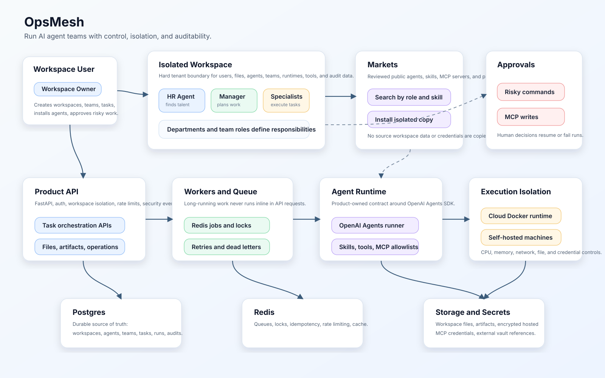

# OpsMesh

Run AI agent teams with control, isolation, and auditability.

OpsMesh is a backend-first platform for operating AI agent teams inside isolated workspaces. Users create agents, assign skills and tools, organize teams and departments, publish reviewed public resources to markets, install reusable agents, skills, MCP servers, and plugins, and run work through an auditable orchestration control plane.

The backend uses the OpenAI Agents SDK as the agent execution foundation and adds the commercial control plane around it: workspaces, marketplace installs, agent teams, task orchestration, workers, Docker runtimes, self-hosted machines, approvals, files, artifacts, encrypted credentials, security events, and auditability.

Frontend work is intentionally not the current focus. The current priority is a reliable backend foundation that can support a mature commercial product.



## Core Stack

- Python backend with OpenAI Agents SDK
- Postgres as the source of truth
- Redis for queues, locks, pub/sub, and short-lived cache
- Worker processes for async agent execution
- Cloud control plane for runtime spaces, worker fleet controls, quotas, and operations
- Docker runtime manager for isolated executable work
- Self-hosted runtime support for user-owned machines
- Workspace-scoped permissions, files, tools, MCP, skills, and runtimes
- Talent marketplace for publishing and installing reusable AI agents
- Encrypted hosted credentials for MCP/tool integrations

## Quick Start

Install dependencies and run checks:

```bash
uv sync --all-groups
uv run ruff check .
uv run pytest
```

Run the local API, worker, Postgres, and Redis stack:

```bash
cp .env.example .env
docker compose up --build
```

The API listens on `http://localhost:8000`.

```bash
curl http://localhost:8000/api/v1/health
curl http://localhost:8000/api/v1/health/ready
```

Run only the API during development:

```bash
uv run uvicorn backend.app.main:create_app --factory --reload --host 0.0.0.0 --port 8000
```

## Deployment

Production API and worker processes run directly on a VPS through systemd and a release-local Python virtual environment. Docker stays on the host only as the substrate for isolated dangerous-task runtimes managed by the worker.

Tagged releases publish a server bundle and manifest for online updates; they do not deploy the backend API or worker as containers.

## Backend Goals

- Enforce strict user and workspace isolation.
- Let each user operate a private agent-team workspace.
- Manage workspace-scoped agents, departments, teams, tasks, runs, files, artifacts, and approvals.
- Support public agent listings and safe installs into another workspace as an isolated copy.
- Require semantic review before public agents, skills, MCP servers, and plugins become visible, while private workspace resources skip review by default unless the workspace opts in.
- Run long-running agent work through workers, not API requests.
- Execute dangerous work only inside Docker or self-hosted isolated runtimes.
- Integrate OpenAI Agents SDK behind a product-owned runtime contract.
- Keep all durable state, audit records, and security events in Postgres.

## Current Backend Capabilities

- Multi-user workspaces with role-based isolation.
- Agent profiles with instructions, skills, tool policy, runtime policy, memory policy, and approval policy.
- Agent teams and departments with manager agents and team roles.
- Talent marketplace listing, search, and install flow.
- Task, run, event, approval, retry, cancellation, and revision flows.
- Redis-backed queues, locks, idempotency, retries, dead letters, worker heartbeats, and API rate limits.
- Runtime space planning for workspace/team execution areas, quota reservations, Docker leases, and operator controls.
- Docker runtime control plane for risky execution.
- Self-hosted runtime enrollment, heartbeat, job polling, progress upload, artifact upload, and credential revocation.
- Workspace files, artifacts, checksums, upload/download authorization, and runtime staging.
- Capability, skill, MCP server, MCP tool allowlist, MCP credential, and MCP tool call logging.
- Hosted MCP credential encryption plus external vault references.
- Operations APIs for queue metrics, failed runs, runtime events, audit filters, and security events.
- Local Docker Compose assets for development and CI checks.

## Documentation

- [Backend Documentation Index](docs/index.md)
- [Backend Task Breakdown](docs/backend-task-breakdown.md)
- [Architecture](docs/architecture.md)
- [Backend Service Architecture](docs/backend-service-architecture.md)
- [Domain Model](docs/domain-model.md)
- [API Design](docs/api-design.md)
- [Domain Task Extensions](docs/domain-task-extensions.md)
- [Backend Runtime Control Plane](docs/backend-runtime-control-plane.md)
- [Cloud Control Plane And Runtime Spaces](docs/cloud-control-plane-and-runtime-spaces.md)
- [Agent Runtime Contract](docs/agent-runtime-contract.md)
- [Capabilities And Runtime](docs/capabilities-and-runtime.md)
- [Workspace Data Management](docs/workspace-data-management.md)
- [Isolation And Security](docs/isolation-and-security.md)
- [Threat Model](docs/threat-model.md)
- [Self-Hosted Runtimes](docs/self-hosted-runtimes.md)
- [MVP Spec](docs/mvp-spec.md)
- [Roadmap](docs/roadmap.md)
- [Backend Completion Plan](docs/backend-completion-plan.md)
- [Decisions](docs/decisions.md)
- [Backend Deployment](docs/backend-deployment.md)
- [Contributing](CONTRIBUTING.md)
- [Security Policy](SECURITY.md)
- [Changelog](CHANGELOG.md)

## Architecture Image

The checked-in architecture image is maintained at [docs/assets/opsmesh-backend-architecture.svg](docs/assets/opsmesh-backend-architecture.svg).

A `gpt-image-2` prompt for regenerating a more visual PNG version is saved at [docs/image-prompts/architecture-gpt-image-2.md](docs/image-prompts/architecture-gpt-image-2.md). The current environment did not expose an image-generation tool or `OPENAI_API_KEY`, so the repository includes a deterministic SVG diagram first.
