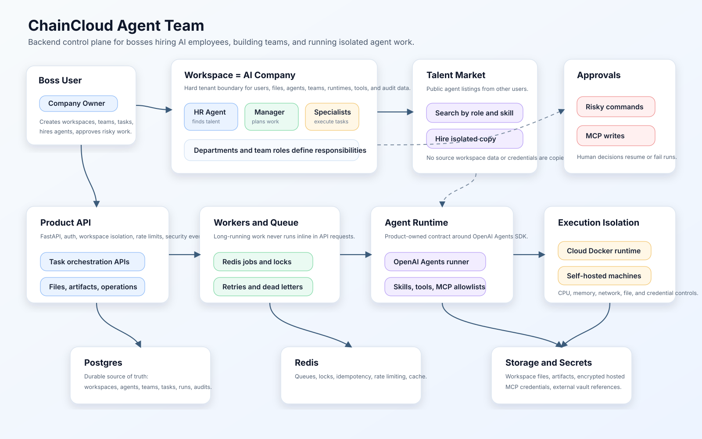

# ChainCloud Agent Team

ChainCloud Agent Team is a backend-first platform for building an AI company inside a workspace. A user acts as the boss: they create AI employees, assign skills and tools, organize departments, publish agents to a talent market, hire public agents created by other users, and run work through an isolated orchestration control plane.

The backend uses the OpenAI Agents SDK as the agent execution foundation and adds the commercial control plane around it: workspaces, talent marketplace hiring, agent teams, task orchestration, workers, Docker runtimes, self-hosted machines, approvals, files, artifacts, encrypted credentials, security events, and auditability.

Frontend work is intentionally not the current focus. The current priority is a reliable backend foundation that can support a mature commercial product.

## Core Stack

- Python backend with OpenAI Agents SDK
- Postgres as the source of truth
- Redis for queues, locks, pub/sub, and short-lived cache
- Worker processes for async agent execution
- Docker runtime manager for isolated executable work
- Self-hosted runtime support for user-owned machines
- Workspace-scoped permissions, files, tools, MCP, skills, and runtimes
- Talent marketplace for publishing and hiring reusable AI agents
- Encrypted hosted credentials for MCP/tool integrations

## Backend Goals

- Enforce strict user and workspace isolation.
- Let each user operate a private AI company workspace as the boss.
- Manage workspace-scoped agents, departments, teams, tasks, runs, files, artifacts, and approvals.
- Support public agent listings and safe hiring into another workspace as an isolated copy.
- Run long-running agent work through workers, not API requests.
- Execute dangerous work only inside Docker or self-hosted isolated runtimes.
- Integrate OpenAI Agents SDK behind a product-owned runtime contract.
- Keep all durable state, audit records, and security events in Postgres.

## Current Backend Capabilities

- Multi-user workspaces with role-based isolation.
- Agent profiles with instructions, skills, tool policy, runtime policy, memory policy, and approval policy.
- Agent teams and departments with manager agents and team roles.
- Talent marketplace listing, search, and hiring flow.
- Task, run, event, approval, retry, cancellation, and revision flows.
- Redis-backed queues, locks, idempotency, retries, dead letters, worker heartbeats, and API rate limits.
- Docker runtime control plane for risky execution.
- Self-hosted runtime enrollment, heartbeat, job polling, progress upload, artifact upload, and credential revocation.
- Workspace files, artifacts, checksums, upload/download authorization, and runtime staging.
- Capability, skill, MCP server, MCP tool allowlist, MCP credential, and MCP tool call logging.
- Hosted MCP credential encryption plus external vault references.
- Operations APIs for queue metrics, failed runs, runtime events, audit filters, and security events.
- Docker Compose deployment assets for API, worker, Postgres, and Redis.

## Documentation

- [Backend Documentation Index](docs/index.md)
- [Backend Task Breakdown](docs/backend-task-breakdown.md)
- [Architecture](docs/architecture.md)
- [Backend Service Architecture](docs/backend-service-architecture.md)
- [Domain Model](docs/domain-model.md)
- [API Design](docs/api-design.md)
- [Domain Task Extensions](docs/domain-task-extensions.md)
- [Backend Runtime Control Plane](docs/backend-runtime-control-plane.md)
- [Agent Runtime Contract](docs/agent-runtime-contract.md)
- [Capabilities And Runtime](docs/capabilities-and-runtime.md)
- [Workspace Data Management](docs/workspace-data-management.md)
- [Isolation And Security](docs/isolation-and-security.md)
- [Threat Model](docs/threat-model.md)
- [Self-Hosted Runtimes](docs/self-hosted-runtimes.md)
- [MVP Spec](docs/mvp-spec.md)
- [Roadmap](docs/roadmap.md)
- [Decisions](docs/decisions.md)
- [Backend Deployment](docs/backend-deployment.md)

## Architecture Image

The checked-in architecture image is maintained at [docs/assets/chaincloud-backend-architecture.svg](docs/assets/chaincloud-backend-architecture.svg).

A `gpt-image-2` prompt for regenerating a more visual PNG version is saved at [docs/image-prompts/architecture-gpt-image-2.md](docs/image-prompts/architecture-gpt-image-2.md). The current environment did not expose an image-generation tool or `OPENAI_API_KEY`, so the repository includes a deterministic SVG diagram first.
