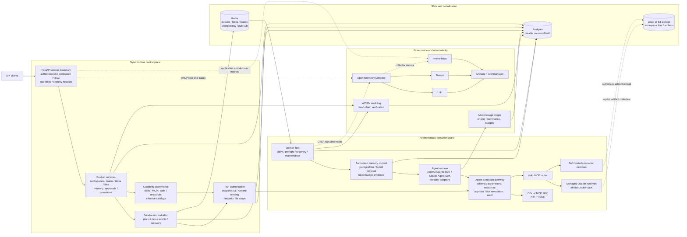
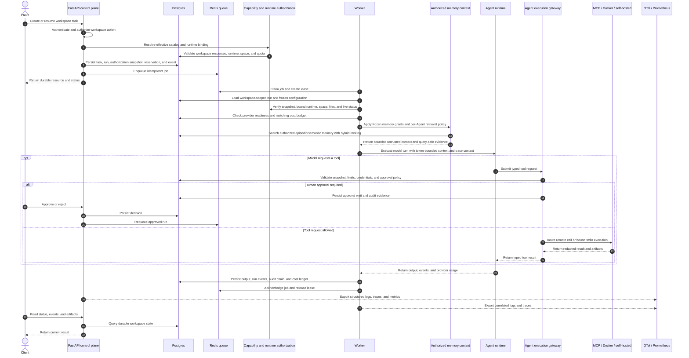

# OpsMesh

Open-source enterprise agent framework for building, operating, and governing teams of AI agents.

OpsMesh is a backend framework and control plane for organizations that need more than a chat
wrapper. It provides durable task orchestration, workspace isolation, capability governance,
human approval, isolated execution, operational visibility, and audit evidence around agent
workflows.

The project is backend-first and pre-1.0. The control plane is the current focus. The Web Portal
under `frontend/` now uses a trimmed `shadcn-admin` application skeleton with TanStack Router,
TanStack Query, theme switching, and Chinese/English locale detection. The first public-API slice
implements password login, current-user validation, protected routing, token revocation, and the
401/403/404/500/503 application states; the remaining product screens are implemented later as
complete vertical slices.

## Why OpsMesh

Agent SDKs are good at model turns, tools, handoffs, sessions, and guardrails. An enterprise agent
system also needs a product-owned layer for tenancy, authorization, durable state, scheduling,
runtime isolation, credentials, approvals, audit, and operations.

OpsMesh focuses on that enterprise control plane while reusing mature open-source SDKs for
protocols and infrastructure. It should not reimplement a standard transport, client, workflow
primitive, or telemetry format unless an evaluated upstream option cannot satisfy the security or
product contract.

## Project Status

2026-09-20: the plugin center is now `jhupo/opsmesh-plugin-center`. SDK 0.5 source separates
platform services, messaging and packaging; card templates and mappings belong to plugins.
This change adds delegated identity, authorized resource discovery and knowledge/memory access.
SDK 0.5.0 and DingTalk plugin 0.3.0 packages are published. Platform `v0.1.0rc18` is published and
passed the complete release and managed-delivery gates; the rc19 source resolves public assets
through the unauthenticated GitHub Release API and resumes interrupted CDN transfers. Current plugin
container acceptance remains pending. Catalog
sync only fetches metadata and never implicitly installs a plugin. Release work also preserves
tenant-wide budget enforcement and keeps archive restore drills separate from the source request's resource scope. See
[plugin integration evidence](docs/plugin-service-integration.md) for the remaining external checks.

Release delivery provides attested GHCR images, native CLI/server archives and a durable host
updater. In `v0.1.0rc18`, both Compose and systemd pass real managed installation, cross-version
upgrade/rollback, killed-updater recovery, startup-failure rollback, and acknowledged restoration
after loss of the application database, followed by another successful upgrade. See
[delivery operations](docs/delivery-operations.md) and the
[acceptance evidence](docs/release-delivery-plan.md). This acceptance covers the supported single-host
Linux amd64/Postgres 16/local-storage maintenance-window topology, not rolling or multi-host upgrades.

| Area | Status |
| --- | --- |
| Backend API and control plane | Implemented and actively evolving |
| Agent and team orchestration | Implemented |
| Worker queues and scheduling | Implemented |
| Docker and self-hosted execution | Implemented |
| MCP, skills, tools, and marketplace | Implemented; remote HTTP/SSE uses the official MCP Python SDK, with explicit discovery and tool enablement |
| Files, artifacts, memory, approvals, and audit | Implemented |
| Web Portal | Application skeleton and password-authentication slice implemented; workspace and product flows have not started |
| Multi-user resource authorization | Implemented: private ownership, per-user action grants, filtered reads, durable execution identity and live revocation; [configuration and migration](docs/multi-user-authorization.md) (2026-09-18) |
| Enterprise SSO and recursive organization policies | Planned |
| Knowledge registry and vector/hybrid retrieval | Implemented: workspace-scoped URL/workspace-file registration, immutable revisions, bounded asynchronous ingestion, isolated URL fetching, citation spans, resource-grant-aware citation retrieval, three-layer memory, hybrid retrieval, and authorized context injection |
| Logs, metrics, tracing, audit integrity, and cost accounting | Implemented; durable correlation and governance evidence cover API, queue, worker, runtime, MCP, audit, and model attempts |
| Kubernetes and multi-region deployment | Future, driven by measured scale requirements |

The APIs and database model may change before the first stable release. See the
[Platform Productionization Plan](docs/platform-productionization-plan.md) for the current scope
and acceptance gates; source code and focused tests remain the implementation authority.

### Reference Architecture Coverage

| Reference layer | Current implementation |
| --- | --- |
| Web Portal and result views | `shadcn-admin`-derived shell, theme, routing, query, i18n, password login and error states implemented; product flows are not implemented |
| SSO, department identity, WAF, and load balancing | Planned; local API authentication and workspace RBAC exist |
| API/Agent Gateway | Implemented at the application boundary: authentication, workspace roles, routing, rate limiting, security headers, and audit |
| Session, configuration, and tool resolution | Implemented, including persistent sessions, effective Agent/team catalogs, fingerprinted authorization snapshot v3 with frozen runtime Profile and provider fallback policy, dynamic SDK tool schemas, and a fail-closed execution gateway |
| Multi-Agent runtime | Implemented with the OpenAI Agents SDK, manager/specialist handoffs, approval waits, durable recovery, and worker restart E2E evidence |
| Capability registry and Tool Gateway | Implemented for skills, MCP discovery/enablement, credentials, allowlists, marketplace lifecycle, approval, limits, redaction, runtime-resource placement, live revocation, and versioned server/tool/credential bindings frozen into each Run |
| MCP execution | Official MCP Python SDK used for Streamable HTTP, SSE, hosted remote servers, and isolated stdio; the self-hosted connector now provides durable claim, execution, completion, and restart recovery |
| Run isolation and workspace | Official Docker SDK and self-hosted control-plane contracts, frozen runtime bindings, runtime-space reservations, exact project snapshot staging, declared-output harvesting, and fail-closed stdio routing are implemented; a dedicated `opsmesh-runtime` image provides the isolated MCP SDK helper and connector CLI |
| Knowledge service | Workspace-scoped source registration, immutable source revisions, idempotent workspace-file/isolated-URL ingestion, citation spans, permission-aware citation retrieval, three-layer memory, Postgres full-text, pgvector/HNSW similarity, weighted hybrid ranking, grant-scoped context injection, lifecycle policy, evidence, v2 workspace export/import, object checksums, and disposable restore drills are implemented |
| Observability and operations | Implemented for the VPS topology: OTLP logs and traces, official Prometheus metrics, Loki, Tempo, Grafana correlation, alerts, WORM audit verification, cost ledger, budgets, queue/runtime diagnostics, and recovery actions |
| Infrastructure and scaling | Postgres, Redis, storage, VPS/systemd, Docker runtime, and remote validation assets exist; Kubernetes, multi-region, and microVM backends are future work |

## Current Architecture

The running backend separates synchronous product APIs, durable state, asynchronous execution,
isolated tool runtimes, governance evidence, and telemetry backends. Postgres remains the source of
truth; Redis contains coordination state only.



## Current Agent Run Flow

API requests persist intent and return without running agent work inline. Workers recover the
complete execution contract from durable state, enforce cost and capability policy, and commit
product evidence independently from telemetry.



## Current Capabilities

### Agent control plane

- Multi-user workspaces with owner, admin, operator, and viewer roles.
- Versioned agent profiles with instructions, model, tool, runtime, memory, and approval policies.
- Agent teams, team roles, organization views, manager agents, and persistent sessions.
- Multi-provider model configuration with encrypted credentials and provider usage evidence.

### Durable orchestration

- Tasks, plans, work packages, steps, runs, events, messages, artifacts, and final outputs.
- Manager planning, specialist execution, dependency-aware scheduling, retries, and cancellation.
- Human approval, correction, regeneration, recovery, and future-only replanning flows.
- Redis-backed queues, locks, idempotency, dead letters, worker leases, and heartbeats.

### Capabilities and tools

- Capability, skill, tool-group, MCP server, credential, and allowlist management.
- MCP execution over isolated stdio plus SDK-backed Streamable HTTP and SSE, with frozen
  server/tool/credential versions, health and quota enforcement, and correlated Run/audit/trace
  evidence.
- Public and private marketplace resources with review, installation, version, and provenance data.
  Signed remote plugins bind workspace MCP, skills, message automations and reply subscriptions;
  trust revocation, disablement and version retirement gate execution. See the
  [remote plugin lifecycle](docs/automation-and-extension-contracts.md) (2026-09-18).
- Message-driven collaboration through the independent connector SDK: explicit follow-ups,
  task pause/resume/cancel, scoped state queries, progress/approval notifications and signed replies.
  Versioned input/output JSON Schemas, explicit model-visible fields, and an async NDJSON
  subscription expose live text previews and safe tool status with replay cursors (2026-09-18).
  External channel plugins stay outside the platform; the local plugin center groups SDK and
  plugin packages separately. Remote migration is complete; no channel business logic is embedded.
- Installation-scoped plugin credentials, private CAS storage, configuration, permission queries
  and redacted logs extend the remote connector boundary without exposing user tokens or SQL.
  Event-scoped card approval decisions reuse task authorization and durable run resumption.
  Private event-bound media inputs feed provider SDKs; hosted plugin processes use durable
  deployment intent and the existing isolated runtime lifecycle, with revocation-driven cleanup.
  See [plugin host services and DingTalk validation status](docs/plugin-service-integration.md)
  (2026-09-19); remote migration, card template import and live DingTalk acceptance remain pending.
- Workspace-approved plugin catalogs pin exact SHA256 snapshots. Background downloads verify
  public HTTPS egress, publisher signatures and platform/SDK compatibility; explicit permission
  and configuration previews lead into the existing install/upgrade lifecycle. See
  [plugin distribution](docs/plugin-distribution.md) (2026-09-18).
- Run authorization snapshots that freeze the capabilities allowed for a concrete execution.

### Isolated execution

- Docker runtime lifecycle with CPU, memory, storage, process, timeout, and network policies.
- Dedicated `opsmesh-runtime:local` image with a non-root MCP Python SDK stdio client and readiness
  probe.
- Runtime spaces, quota reservations, leases, cleanup evidence, and operator controls.
- Self-hosted runtime enrollment, trust state, heartbeat, job claim, progress, and artifact upload.
- Gateway-scoped workspace file content access with frozen grants, MIME/size limits, bounded Local
  or S3 reads, and integrity verification. Managed Docker and self-hosted agent runs stage their exact
  project snapshot and harvest only declared outputs without exposing storage keys to runtimes.
- Downloadable artifact bytes use workspace/artifact-ID object keys and compensated persistence, so
  failed storage or database writes cannot leave a committed metadata-only artifact.

### Governance and operations

- Human approvals for risky operations and fail-closed policy enforcement.
- Encrypted hosted credentials, external vault references, redaction, and egress validation.
- Durable audit and security events, including database-level WORM protection and scheduled
  workspace hash-chain verification.
- Structured OTLP logs, OpenTelemetry traces, official Prometheus metrics, Loki/Tempo/Grafana
  correlation, alert delivery, model usage/cost ledgers, pricing rules, and budget enforcement.
- Scheduled jobs, notifications, signed webhooks, and workspace import/export lifecycle support.

## Architecture Principles

1. The workspace is the tenant, authorization, data, tool, and runtime boundary.
2. Postgres is the durable source of truth. Redis only stores coordination or derived state.
3. Models may propose actions; application services validate and commit state transitions.
4. Long-running work executes in workers, never inside an API request.
5. Untrusted code and local tool processes execute only in an approved isolated runtime.
6. Every orchestrated run receives an immutable authorization snapshot for its Agent, skills,
   tools, resources, runtime binding, file scope, and provider.
7. Secrets are injected only at the execution boundary and must never enter logs or API responses.
8. Audit records remain independent of model-provider tracing.
9. Domain contracts stay product-owned; standard protocols and infrastructure use mature SDKs.
10. Compatibility code is prohibited; contract changes update all in-repository callers directly.
11. When an adopted SDK provides a capability, call its public interface directly; custom code may
    only enforce OpsMesh policy or translate the product contract.

## Open-Source First

OpsMesh already builds on FastAPI, SQLAlchemy, Alembic, Pydantic, Redis, Postgres, the Python
[OpenAI Agents SDK](https://github.com/openai/openai-agents-python) (`openai-agents` on PyPI), and the
[Claude Agent SDK](https://github.com/anthropics/claude-agent-sdk-python). Both provider SDKs sit
behind the same product-owned runtime contract; authorization, durable state, policy, redaction,
audit, and capability negotiation remain in the OpsMesh control plane.

| Area | Preferred upstream | Direction |
| --- | --- | --- |
| Agent turns, tools, sessions, HITL | Python OpenAI Agents SDK and Claude Agent SDK | Provider execution cores behind one OpsMesh contract; provider-specific capabilities are explicit |
| Semantic resource review | OpenAI and Anthropic Python SDK structured-output parsers | Provider protocol adapters behind one review contract; OpsMesh keeps redaction, policy merge, and fail-closed activation |
| MCP protocol and transports | [MCP Python SDK](https://github.com/modelcontextprotocol/python-sdk) | Current for remote Streamable HTTP/SSE and isolated stdio; keep the SDK client inside Docker/self-hosted runtimes |
| Docker Engine access | [Docker SDK for Python](https://docs.docker.com/reference/api/engine/sdk/) | Current managed-runtime implementation behind the OpsMesh runtime client contract; no CLI fallback |
| Logs, traces, and instrumentation | [OpenTelemetry Python](https://github.com/open-telemetry/opentelemetry-python) | Current for API/worker OTLP logs and FastAPI, database, Redis, HTTP, queue, model, and tool traces |
| Prometheus exposition | [Prometheus Python client](https://github.com/prometheus/client_python) | Current; domain collectors publish through official Counter, Histogram, and Gauge primitives |
| Vector and hybrid retrieval | [pgvector-python](https://github.com/pgvector/pgvector-python) | Current Postgres vector type, cosine search, and HNSW index; OpsMesh owns scoped hybrid ranking and lifecycle policy |
| OAuth 2.0 and OpenID Connect | [Authlib](https://authlib.org/) | Use for future enterprise SSO; do not build an identity provider |
| Durable workflows | [Temporal Python SDK](https://github.com/temporalio/sdk-python) | Run an architecture spike before replacing the current queue and state machine |
| Fine-grained authorization | [OpenFGA](https://github.com/openfga/openfga) or [OPA](https://www.openpolicyagent.org/) | Evaluate only when concrete relationship or policy requirements exceed current RBAC |

Any-LLM and LiteLLM integrations provided by the Agents SDK are candidates for provider expansion,
but they are currently treated as evaluation items. They must pass OpsMesh contract tests for tool
calling, structured output, streaming, usage data, error mapping, and credential isolation before
they replace a production provider adapter.

See [Open-Source SDK Strategy](docs/open-source-sdk-strategy.md) for the adoption criteria,
recommended order, and boundaries that remain owned by OpsMesh.

## Next Goals

Active implementation follows the
[Platform Productionization Plan](docs/platform-productionization-plan.md). Runtime workflow,
recovery, operations evidence, architecture gates, knowledge-source registration and the current
directory consolidation are implemented. Release readiness is still established only by the
tag-triggered gate: complete tests, real PostgreSQL migration checks, package/image probes, signed
publication and managed delivery acceptance. Normal development uses focused checks.

### 1. Restore and protect the quality baseline

- Keep Ruff, mypy, and migrations green after the current modularization. Run focused tests during
  development; reserve the complete suite for the release-tag gate.
- Enforce the implemented seven import-boundary contracts in CI: HTTP transport ownership,
  infrastructure independence, transport-free pagination, production/test separation, Docker/S3
  adapter access, and provider-neutral Agent contracts. See [architecture gates](docs/architecture-gates.md).
  Public service-facade consolidation remains separate work; the gate does not claim all domain
  dependencies are acyclic.
- Reduce oversized modules without creating chains of pass-through wrappers.
- Establish coverage expectations for tenant denial paths and isolated execution.

### 2. Consolidate upstream SDK usage

- Keep the SDK-backed stdio entrypoint and self-hosted request contract versioned, then evaluate MCP
  Python SDK v2 when the OpenAI Agents SDK supports it; keep authorization and audit at the OpsMesh
  boundary.
- Keep Docker SDK daemon access isolated behind the runtime client while extending per-run
  hardening, termination, and cleanup proof.
- Operate and extend the OpenTelemetry and official Prometheus paths without introducing custom
  telemetry protocols.
- Review native Agents SDK HITL, run-state, sandbox, and durable-execution integrations.

### 3. Build a unified capability and knowledge plane

- Extend the implemented unified product/MCP/resource catalog with permission-aware knowledge
  retrieval and citation contracts.
- Add policy-driven ephemeral sandbox creation, per-run file materialization, and selected artifact
  harvesting on top of the implemented frozen runtime binding.
- Expand permission-aware citation retrieval with richer resource-grant filtering and operator views.

### 4. Add enterprise identity and policy integration

- Add OIDC-based SSO with external identity providers.
- Define service-account and workload-identity contracts.
- Evaluate OpenFGA for relationship authorization and OPA for runtime/tool policy decisions.
- Preserve local RBAC as the simple deployment mode.

### 5. Build the Web Portal

- The React, TypeScript, Vite, TanStack and shadcn/ui boundary is documented in
  `docs/frontend-architecture.md` and `frontend/README.md`.
- Keep the implemented password login, current-user guard, session revocation, and application
  error routes aligned with the public authentication API.
- Implement user journeys for workspace setup, agent/team configuration, task execution,
  approval, observation, artifacts, capability management, and operations as complete product
  flows.
- Keep the frontend as a separate client of public APIs; it must not depend on backend internals.

### 6. Scale from evidence

- Decide whether Temporal materially simplifies durable waits, retries, and recovery before migration.
- Add horizontally scalable deployment, managed data services, and Kubernetes packaging when demand
  exceeds the current VPS/systemd model.
- Evaluate microVM or managed sandbox backends for higher-assurance hostile multi-tenant execution.
- Evolve cost policy from the workspace ledger and budget guardrail using measured provider usage;
  keep billing concerns outside core execution.

## Repository Layout

```text
backend/app/api/                              HTTP transport, routes, schemas, dependencies, middleware
backend/app/bootstrap/                        Application composition and infrastructure registration
backend/app/domains/agents/                   Agent profiles, SDK runtime, memory, and providers
backend/app/domains/agents/{profiles,memory,messages,providers,runtime}/  Agent lifecycle and execution domains
backend/app/domains/agents/runtime/providers/{openai,claude}/ OpenAI and Claude SDK adapters
backend/app/domains/capabilities/           Skills, MCP, tools, marketplace, and policy
backend/app/domains/orchestration/          Requests, runs, approvals, tasks, and workflows
backend/app/domains/workspace/              Workspace tenant, projects, teams, storage, and reviews
backend/app/domains/access/                 Users, tokens, membership, RBAC, and authenticated context
backend/app/domains/platform/               Platform administration, releases, and updates
backend/app/domains/integrations/           Webhook and external integration domains
backend/app/runtime/                         Runtime, worker, operations, and self-hosted execution
backend/app/observability/                   Audit, traces, costs, notifications, and telemetry
backend/app/core/                            Config, errors, persistence, Redis, security, and shared primitives
backend/migrations/           Alembic schema history
backend/tests/                Unit and integration-style backend tests
deploy/                       VPS/systemd and monitoring assets
docs/                         Architecture, security, API, and operating guides
```

## Quick Start

Requirements:

- Python 3.11 or newer
- [uv](https://docs.astral.sh/uv/)
- Docker with Docker Compose for the complete local stack

Install dependencies and run the quality checks:

```bash
uv sync --all-groups
uv run ruff check .
uv run mypy
uv run pytest backend/tests/test_health.py
```

Run the tests that cover the modules you changed. The complete pytest suite is a release gate and
is run only by the tag-triggered release gate, before artifact publication.

Start the API, worker, Postgres, and Redis:

```bash
cp deploy/local/env.example .env
docker build -f deploy/images/Dockerfile.runtime -t opsmesh-runtime:local .
docker compose -f deploy/local/compose.yml up --build
```

Install and run the self-hosted MCP connector after registering a runtime and receiving its runtime
credential:

```bash
python -m pip install ./runtime
export OPSMESH_API_URL=https://opsmesh.example.com/api/v1
export OPSMESH_RUNTIME_CREDENTIAL=ccwc_replace_with_runtime_credential
opsmesh-self-hosted-worker --state-path ~/.opsmesh/connector-state.sqlite3
```

The connector executes only the versioned stdio MCP request contract through the official MCP
Python SDK. It persists claimed work and completed results locally so a restart can resume delivery
without repeating a recorded tool result. See the
[self-hosted connector guide](docs/self-hosted-connector.md) for registration, security, recovery,
and service deployment details.

On PowerShell, use `Copy-Item deploy/local/env.example .env` instead of `cp`.

The API listens on `http://localhost:8000` by default:

```bash
curl http://localhost:8000/api/v1/health
curl http://localhost:8000/api/v1/health/ready
```

When API documentation is enabled, OpenAPI is available at `http://localhost:8000/docs`.

The pushed release tag triggers the complete suite in CI. Normal development uses focused tests;
do not duplicate the full release gate locally.

Run only the API during development:

```bash
uv run uvicorn backend.app.main:create_app --factory --reload --host 0.0.0.0 --port 8000
```

## Deployment

Ready-to-run release artifacts and their tested platforms are described in
[Standalone Distributions](docs/standalone-distributions.md). Native CLI archives include Python;
the Linux amd64 server archive includes CPython and locked production dependencies. Developer
`.whl`/source packages are separate assets. Follow [Delivery Operations](docs/delivery-operations.md)
for checksum validation and managed installation.

The public bootstrap resolves immutable assets through the unauthenticated GitHub Release API,
retries and resumes transient HTTP, DNS, connection and TLS failures, then verifies the completed
native CLI archive before executing it. It never clones or builds the repository on the
installation host and does not require GitHub CLI or login.

The current production model uses the managed release package with Compose by default and systemd
as an explicit alternative. The worker uses Docker for isolated task runtimes; the API has no
Docker daemon access.

安装完成后会在终端打印一次随机生成的 `superadmin` 管理员密码；忘记密码可在安装主机执行
`sudo opsmesh --root /opt/opsmesh admin reset-password` 重置。

See [Backend Deployment](docs/backend-deployment.md) for release bundles, service users, runtime
permissions, health checks, monitoring, updates, and rollback.

## Documentation

- [Documentation Index](docs/index.md)
- [Architecture](docs/architecture.md)
- [Backend Service Architecture](docs/backend-service-architecture.md)
- [Agent Runtime Contract](docs/agent-runtime-contract.md)
- [Capabilities And Runtime](docs/capabilities-and-runtime.md)
- [Runtime Control Plane](docs/backend-runtime-control-plane.md)
- [Cloud Control Plane And Runtime Spaces](docs/cloud-control-plane-and-runtime-spaces.md)
- [Isolation And Security](docs/isolation-and-security.md)
- [Threat Model](docs/threat-model.md)
- [Open-Source SDK Strategy](docs/open-source-sdk-strategy.md)
- [Observability, Audit, and Cost Operations](docs/observability-audit-and-costs.md)
- [Platform Productionization Plan](docs/platform-productionization-plan.md)
- [Independent Plugin SDK](https://github.com/jhupo/opsmesh-plugin-center)
- [Code Organization and Architecture Boundaries](docs/code-organization-audit.md)

## Contributing

Changes must enter `master` through feature-branch pull requests. See [GitHub security and collaboration
automation](docs/github-automation.md) for checks, dependency updates, labels and repository settings.

Contributions are welcome. Start with [CONTRIBUTING.md](CONTRIBUTING.md) and the repository
instructions in [AGENTS.md](AGENTS.md). Changes that affect authorization, execution, credentials,
or tenant-owned data require success-path and denial-path tests.

Please report security issues through [SECURITY.md](SECURITY.md), not a public issue.

## License

OpsMesh platform, operator and runtime are licensed under [LGPL-3.0-only](LICENSE),
with the incorporated GPL terms in [COPYING](COPYING).
Existing copyright and MIT permission notices are preserved in [NOTICE](NOTICE)
and [LICENSE-MIT](LICENSE-MIT). See [licensing scope](docs/licensing.md)
for commercial use and distribution obligations (updated 2026-09-18).
