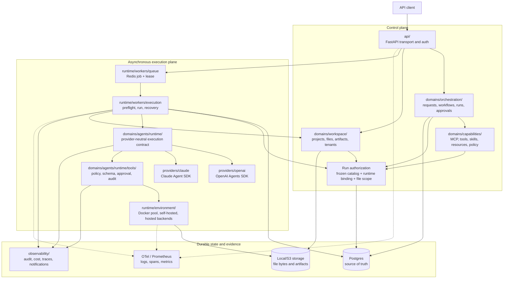
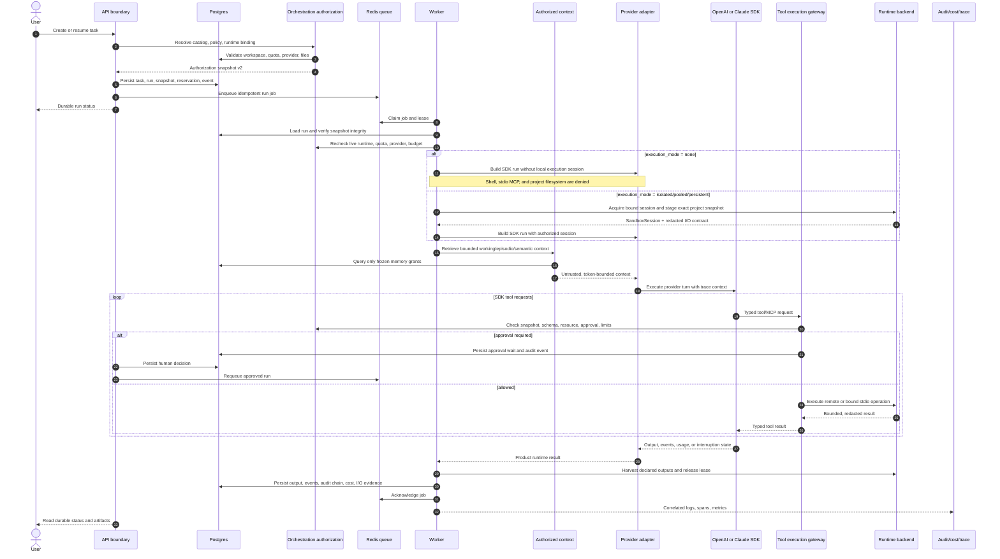

# Agent Runtime Architecture

Status: current implementation, 2026-09-13.

This document is the authoritative view of one OpsMesh agent run. It describes the boundaries that
are implemented today; it does not describe a future canvas format or a provider-specific product
API. The API, orchestrator, worker, provider SDK adapters, execution runtimes, project I/O, and
governance evidence remain separate responsibilities even when they run in the same deployment.

## Boundary map

The provider adapters are implementations of the product-owned runtime contract. They translate
agent profiles, sessions, guardrails, streaming, structured results, handoffs, and usage into that
contract. They do not perform workspace authorization, choose a runtime, or write provider objects
into Postgres. The OpenAI adapter uses the official OpenAI Agents SDK, and the Claude adapter uses
the official Claude Agent SDK. A provider-specific feature is exposed only when the capability
matrix says it is supported; there is no silent cross-provider fallback.

The execution runtime is a separate resource boundary. It owns Docker lifecycle and pooling,
self-hosted dispatch, resource limits, network policy, command execution, stdio MCP placement,
workspace mounts, cleanup, and runtime evidence. The agent adapter receives a `SandboxManifest` and
the acquired session; it never owns the Docker lease or container lifecycle.

## Run lifecycle

Every transition that can affect a side effect is guarded by the immutable authorization snapshot.
The worker validates it again after a queue lease is acquired, so a revoked capability, changed
runtime policy, exhausted quota, or stale provider cannot be used merely because a job was already
queued. Approval resumes requeue durable state; they do not resume an SDK object inside an API
request.

## Execution modes

`execution_mode` is explicit on the run request and in the authorization snapshot:

| Mode | Local execution session | Permitted capabilities |
| --- | --- | --- |
| `none` | None | Hosted tools, remote MCP, model, memory, approvals; no shell, stdio MCP, or project filesystem |
| `isolated` | A new isolated runtime | Shell, stdio MCP, and project files within the frozen policy |
| `pooled` | A leased pre-warmed runtime with a run-specific workspace | Same capabilities as isolated; reset and release are mandatory |
| `persistent` | A bound runtime for an explicitly continuous session | Same capabilities across approved turns, with persistent policy and lease checks |

An empty or omitted runtime configuration never means “execute on the API/worker host”. The
authorization service rejects a request that requires a runtime while its mode is `none`. Runtime
resources are created or bound only for the three non-`none` modes and are released or reclaimed
with durable evidence.

## Project I/O and evidence

Project input is an immutable, checksummed snapshot. Staging copies only authorized paths into the
runtime workspace; storage keys and credentials are not exposed to the provider SDK. Harvesting
accepts only declared output paths, writes artifact bytes with compensation, and records file-access
and run-event evidence. Final artifacts are read through the workspace gateway, not directly from a
container.

Run events, audit events, model usage/cost records, runtime I/O records, and OpenTelemetry signals
share stable workspace/task/run correlation. Product audit and cost rows remain durable Postgres
records even when telemetry export is unavailable; telemetry is complementary evidence, not the
source of truth.

## Extension rule

Adding a provider means implementing the runtime contract under
`backend/app/domains/agents/runtime/providers/<provider>/` and registering its capability matrix.
Adding a provider-native sandbox is optional: map it to the shared sandbox contract when it exists;
otherwise use the existing `runtime/environment` backend registry and pool. Provider adapters must
not introduce a second authorization, memory, project-I/O, Docker, or audit implementation.

The stable boundaries and their owning code are listed in
[Backend Service Architecture](backend-service-architecture.md), while the acceptance status for
the integrated runtime is tracked in the [Agent Runtime Completion Plan](agent-runtime-completion-plan.md).
