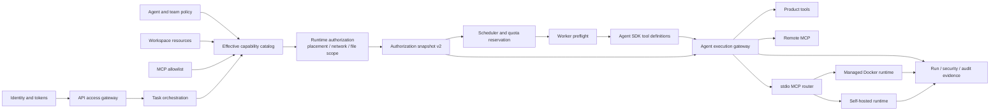

# Architecture

## Product Shape

OpsMesh is a multi-user workspace product for operating AI agent teams inside isolated user workspaces. The OpenAI Agents SDK and product-owned provider adapters provide model execution primitives, while this application owns the business layer: users, workspaces, agent definitions, task orchestration, permissions, persistence, audit logs, markets, cost accounting, and product APIs.

The core unit is a workspace. A workspace is the boundary for data, agents, tasks, tools, files, memory, and access control.

User and workspace isolation is mandatory. The product must enforce isolation across application APIs, Postgres queries, Redis keys, file storage, agent runtime context, tools, memory retrieval, background workers, and audit logs. See [Isolation And Security](isolation-and-security.md).

## System Layers

1. Application API

   Handles authentication, workspace membership, CRUD APIs, task creation, approvals, notifications, and API-facing queries.

2. Orchestration Service

   Converts workspace tasks into agent runs, manages task state transitions, coordinates manager and specialist agents, persists run events, and resumes paused runs.

3. Agent Runtime

   Uses `openai-agents-python` to run `Agent`, `Runner`, tools, handoffs, guardrails, sessions, tracing, and sandbox agents. Runtime code should be mostly stateless and driven by database configuration. User-controlled or agent-controlled executable work must run inside an isolated runtime, never directly on the application server host.

4. Persistence

   Postgres is the source of truth. Redis is used only for derived, short-lived, or coordination data.

5. Worker Layer

   Background workers execute long-running agent runs, tool calls, file indexing, memory consolidation, and webhook delivery.

6. Runtime Control Plane

   API services persist runtime intent and enqueue runtime-control work. Workers provision and
   operate Docker-backed isolated runtimes, apply hardening and limits, enforce frozen placement
   and network policy, route approved stdio MCP calls, and record lifecycle and cleanup evidence.
   Workspace file bytes remain behind the product gateway unless an explicit staging workflow
   copies them into a controlled runtime root. See
   [Runtime Control Plane](backend-runtime-control-plane.md).

7. Cloud Control Plane

   Platform operator services manage runtime spaces, worker fleet health, queue pressure, quota reservations, Docker leases, self-hosted trust state, network policy, and cleanup evidence. This is still personal-workspace oriented and does not require a billing or company-account layer. See [Cloud Control Plane And Runtime Spaces](cloud-control-plane-and-runtime-spaces.md).

The backend should be organized into three major domains: the OpenAI Agents Runtime Layer, the Agent Management and Orchestration Layer, and the Product Backend Service Layer. Long-running work is executed by workers through queues and persisted state, not directly inside API requests. See [Backend Service Architecture](backend-service-architecture.md).

The runtime model supports both platform-managed Docker runtimes and self-hosted connector runtimes on user-owned machines. Self-hosted workers connect outbound to the platform, keep sensitive data local when configured, and execute tasks in local isolated runtimes. See [Self-Hosted Runtimes](self-hosted-runtimes.md).

## Multi-User Workspace Model

Primary entities:

- `users`: Human accounts.
- `workspaces`: Tenant boundary for one user's or one account's AI workforce and product data.
- `workspace_members`: User membership and role inside a workspace.
- `agent_profiles`: Versioned agent definitions owned by a workspace.
- `agent_teams`: Named collections of agents with coordination rules.
- `tasks`: User-created or agent-created units of work.
- `task_steps`: Planned sub-work owned by a task.
- `agent_runs`: Concrete executions of one agent against one task or step.
- `run_events`: Append-only event stream for model calls, tool calls, handoffs, approvals, errors, and final outputs.
- `approvals`: Human approval requests for sensitive actions.
- `workspace_files`: Files and artifacts available to workspace tasks.
- `memory_entries`: Workspace-scoped or agent-scoped long-term memory.
- `audit_events`: Security and governance trail.

Every workspace-owned table should include `workspace_id`. Queries should always scope by workspace membership.

Application code must never authorize or load workspace-owned data by resource ID alone. Reads, updates, deletes, background jobs, tool calls, and memory retrieval must all include workspace scope.

## Roles And Permissions

Initial workspace roles:

- `owner`: Manage workspace settings, members, agents, tools, and destructive actions.
- `admin`: Manage agents, tasks, files, and most tools.
- `operator`: Create and supervise tasks, approve allowed actions.
- `viewer`: Read-only access to tasks, runs, files, and reports.

Agent permissions are separate from human permissions. Each agent profile should declare:

- allowed tool groups
- allowed file scopes
- allowed external connectors
- approval policy
- maximum run duration
- maximum retry count
- whether it may create new tasks
- whether it may delegate to other agents

## Agent Model

An agent profile stores configuration, not arbitrary application code:

- name
- role description
- instructions
- model
- model settings
- enabled tools
- handoff targets
- guardrails
- memory policy
- sandbox policy
- version
- status

The runtime turns an `agent_profile` into an OpenAI Agents SDK `Agent` and executes it through the
SDK runner. Provider-specific adapters remain behind the same product-owned run contract, while
executable tools cross the isolated runtime boundary.

Specialist agents should be exposed in two ways:

- handoffs when the specialist should take over the conversation or task step
- agents-as-tools when a manager agent should keep orchestration control

## Task Orchestration

Task lifecycle:

```text
draft -> queued -> planning -> running -> waiting_approval -> running -> completed
                                      -> blocked
                                      -> failed
                                      -> cancelled
```

Current durable workflow:

1. User creates a task in a workspace.
2. The orchestrator computes the Agent/team effective capability catalog and resolves an exact
   runtime binding covering concrete runtime, runtime space, network policy, resource provenance,
   and gateway-only file scope.
3. Authorization snapshot v2 freezes both contracts; the scheduler reserves capacity in the
   selected runtime space before persisting and enqueueing the run.
4. A worker claims the job under a lease, verifies snapshot integrity, and rechecks live runtime,
   runtime-space, resource, provider, pricing, and budget state before side effects.
5. Manager and specialist agents execute through the Agent runtime and durable handoff state.
6. The model receives only frozen tool descriptors. Product and MCP calls cross the Agent execution
   gateway for schema, locked-parameter, resource-scope, live-status, provenance, and approval checks.
7. stdio MCP calls can run only on the concrete active runtime frozen into the run; remote MCP and
   product tools stay on their dedicated routes.
8. Human approvals persist a wait state; an approved run is requeued instead of resumed inside the API request.
9. The worker stores output, artifacts, run events, audit hashes, and model usage costs before acknowledging the job and releasing reservations.
10. API and worker logs and traces share W3C trace context; Prometheus exposes application and governance metrics.



The orchestrator, not the model, owns durable state transitions. Models may propose plans and actions, but the service validates and persists them.

## Postgres Responsibilities

Use Postgres for:

- users, workspaces, membership
- agent definitions and versions
- tasks and task steps
- run records and event logs
- approvals
- files and artifact metadata
- memory entries
- audit logs
- durable workflow state

Postgres should be treated as the only source of truth. Anything required to recover after a crash belongs in Postgres.

## Redis Responsibilities

Use Redis for:

- task queues or worker coordination
- distributed locks for task/run execution
- short-lived run progress cache
- websocket/SSE pub-sub fanout
- rate limit counters
- idempotency windows
- temporary tool output cache

Do not store irreplaceable task state only in Redis.

All Redis keys that refer to workspace data must include `workspace_id`, for example `workspace:{workspace_id}:...`, `run:{workspace_id}:{run_id}:...`, or `lock:{workspace_id}:{resource_type}:{resource_id}`.

## Agent Memory

Provider conversation state and transcript compaction belong to the OpenAI and Claude SDK session
implementations. Product memory is durable Postgres state with three explicit layers:

- `working`: run-scoped objective, plan, step, temporary fact, and tool-result state with TTL and
  entry/token limits;
- `episodic`: redacted task, run, failure, approval, correction, and human-feedback events with
  provenance and retention policy;
- `semantic`: versioned workspace, team, or agent facts, configuration, policies, and procedures.

Each Agent request uses its frozen `memory_collection` read grants to prefilter long-term candidates
before hybrid full-text/vector ranking. Separate grants stay separate: source, tag, scope type, and
scope ID restrictions are evaluated together per grant and are never unioned into a wider Cartesian
scope. Selected results are marked as untrusted historical references, bounded by both the memory
policy and the model context budget, and recorded through query-safe fingerprints and inclusion
evidence. Custom memory metadata is namespaced and cannot override authoritative scope fields.

## Human Approval

Actions that should require approval:

- running shell commands in privileged environments
- editing or deleting workspace files
- sending external messages
- calling write-capable third-party APIs
- creating new agents or changing agent permissions
- publishing final artifacts outside the workspace

Approval records must include requester agent, proposed action, arguments, risk level, approver, decision, and final outcome.

## Observability, Audit, And Cost

The product captures:

- task state changes
- agent run start/end
- model used
- tool calls and results
- handoffs
- guardrail results
- approvals
- errors and retries
- generated artifacts
- model token usage, pricing snapshots, cost totals, and budget state

OpenTelemetry exports correlated API, worker, database, Redis, model, MCP, and tool spans to Tempo,
and structured redacted logs to Loki. Prometheus collects application, queue, runtime, audit
integrity, and cost-governance metrics for Grafana and Alertmanager. Product audit logs remain
independent of tracing, are hash chained, and are WORM protected in Postgres.

## Current Execution Guarantees

1. API routes authorize and persist intent; long-running work executes only in workers.
2. Postgres holds every state needed for restart recovery; Redis state is replaceable coordination data.
3. Every worker, tool, file, memory, and runtime lookup carries workspace scope.
4. Provider credentials are resolved and decrypted only at the narrow execution boundary.
5. Frozen tool manifests, schemas, parameter locks, resource scopes, live revocation, approval,
   runtime isolation, quota, and cost limits fail closed.
6. Run events, product audit evidence, model usage, artifacts, and failure state are durable.
7. Logs, traces, and metrics are correlated but never replace product audit records.

Workspace files and artifacts are first-class resources. Uploads, downloads, previews, runtime staging, artifact collection, and exports must all enforce workspace authorization. See [Workspace Data Management](workspace-data-management.md).
