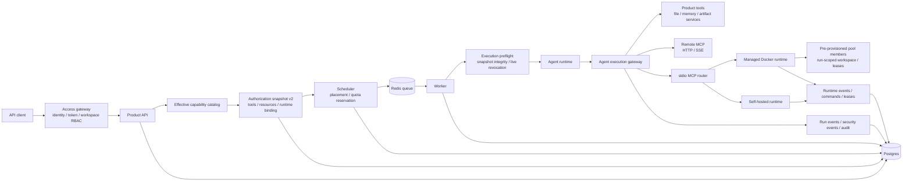
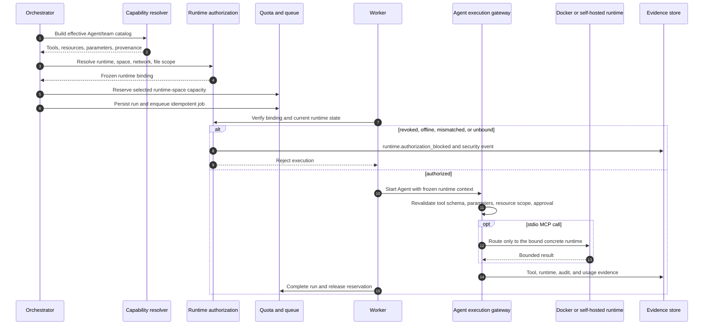

# Runtime Control Plane

## Scope

OpsMesh separates durable control-plane decisions from executable runtime work. FastAPI persists
intent and enqueues jobs. Workers validate the frozen run contract and are the only application
processes allowed to operate managed Docker runtimes. Self-hosted connectors use the same
workspace-scoped placement contract while polling outbound from user-owned machines.

The current implementation supports explicit managed runtimes and self-hosted runtimes. Managed
runtimes expose selectable `isolated`, `pooled`, and `persistent` execution modes. A run that needs
stdio MCP execution must resolve to an active, online concrete runtime before it can be scheduled;
the worker then applies the selected mode and records the concrete pool lease when applicable.

## Current Architecture



## Isolation Invariants

1. Every runtime, runtime space, run, resource grant, reservation, and event is scoped by
   `workspace_id`.
2. User-controlled commands and stdio MCP processes never execute in the API process or directly
   on the application host.
3. A scheduled run uses one immutable `runtime_binding`; the worker and stdio router compare it
   with the concrete `AgentRun` placement.
4. Runtime and runtime-space status are rechecked at execution time. Stop, quarantine, revoke, or
   unbind therefore acts as an emergency stop for queued work.
5. Runtime-space capacity is reserved before a run is created and attached to the run in the same
   scheduling path. Terminal lifecycle transitions release the reservation.
6. Workspace files remain behind the product execution gateway. A stdio process receives no
   workspace storage mount from the Agent run contract.
7. Managed containers never receive the Docker socket, broad host paths, or application secrets.

## Runtime Placement

The scheduler resolves placement from four durable inputs:

- executable `runtime` resources in the effective capability catalog;
- the Agent team's explicitly bound workspace runtime;
- the task or task-step runtime space;
- the selected runtime's own runtime-space membership.

Resolution fails closed when more than one runtime or runtime space is granted, a grant conflicts
with team/task placement, a scoped runtime space lacks an active team/task binding, or the selected
runtime is not active and online. A stdio MCP tool requires a concrete runtime; a runtime-space-only
grant is not sufficient.

The selected network policy is the restrictive union of Agent, runtime-space, and concrete-runtime
policy. If the frozen contract requires disabled network access, the concrete runtime must already
enforce `network_policy.disabled=true`.

## Frozen Runtime Binding

Authorization snapshot v2 includes a runtime binding similar to:

```json
{
  "mode": "capability_runtime",
  "workspace_id": "...",
  "workspace_runtime_id": "...",
  "runtime_space_id": "...",
  "capability_resource_ids": ["..."],
  "network_disabled": true,
  "file_access_scope": {
    "mode": "gateway_only",
    "allowed_file_ids": ["..."]
  }
}
```

`capability_resource_ids` preserves why the placement was allowed. `allowed_file_ids` is the
intersection of active read-capable file resources and any task-step file restriction. It is a
gateway authorization scope, not a promise that those bytes are mounted into the runtime.

Removing the binding, changing its workspace/runtime/space, expanding its file IDs, changing the
run placement, or disabling a referenced file/resource causes worker preflight to reject the run.
The snapshot fingerprint protects stored integrity; live database checks provide emergency
revocation.

## Scheduling And Execution Flow



## File Boundary

Product file tools validate both the frozen file IDs and current workspace ownership before reading
object storage. Remote MCP and stdio MCP receive only validated tool arguments and explicitly
resolved credentials. The Agent runtime contract does not expose the workspace file store as a
container mount.

`RuntimeFileService` remains an explicit low-level staging/collection service for workflows that
deliberately copy a file into a controlled runtime root. Callers must provide a workspace-scoped
`ToolContext`, and relative paths are checked against traversal. Automatic per-run staging and
artifact harvesting are not part of the current Agent scheduling path and must not be inferred from
the frozen file access scope.

## Managed Docker Runtime

Managed runtimes are provisioned asynchronously through runtime-control jobs. The worker applies:

- dedicated Docker volume and workspace/runtime labels;
- CPU, memory, disk, process, timeout, and output limits;
- read-only root filesystem plus bounded hardened tmpfs mounts;
- dropped Linux capabilities and `no-new-privileges`;
- isolated/default-denied networking according to resolved policy;
- no host Docker socket and no broad host bind mount.

Runtime state, commands, leases, capacity reservations, lifecycle events, and cleanup evidence are
stored in Postgres. Docker is execution state, not the durable source of truth.

## Self-Hosted Runtime

A self-hosted worker authenticates with a runtime-scoped credential, then polls only runs targeted
to its workspace runtime. Poll and claim both verify trust state, worker capacity, runtime-space
compatibility, frozen runtime binding, and current runtime availability. stdio MCP work uses a
separate durable request/claim/completion contract with restart recovery and idempotent result
delivery.

Directly targeted administrative self-hosted runs without an Agent authorization snapshot remain a
separate explicit-runtime operation. Runs produced by Agent orchestration carry the snapshot and
must pass the stricter binding checks.

## API And Operations Surface

Workspace members with runtime-management permission can list templates; create, start, stop, and
delete runtimes; enqueue commands; inspect command history and runtime events; and manage runtime
spaces, bindings, quotas, pause/resume, reset, diagnostics, and force-release operations.

Platform operators have separate APIs for runtime-space quarantine, runtime force-stop, lease
inspection, worker controls, queue recovery, and risky-execution kill switches. All endpoints use
workspace or operator authorization before loading target objects.

## Failure Evidence

- Scheduling denials store a stable blocked reason on the task step.
- Worker runtime denials append `runtime.authorization_blocked` and
  `agent_runtime.authorization_blocked` security evidence.
- stdio routing denials append `agent_runtime.stdio_blocked` security evidence.
- Runtime creation, start, stop, command, cleanup, lease, and cleanup-failure paths append durable
  runtime events.
- Logs, traces, and Prometheus metrics correlate operations, but they do not replace product audit
  or run events.

## Deliberate Future Work

- higher-assurance microVM or managed sandbox backends;
- pool autoscaling and warm image pre-pull orchestration;
- runtime snapshots and restore workflows for persistent sessions.

These items are not described as current guarantees. Adding them must preserve the same frozen
authorization, workspace isolation, audit, quota, and cleanup contracts.
