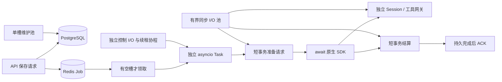

# Worker 协程并发与任务控制

日期：2026-10-09。本文描述当前分支实现。代码尚未部署，服务器 OpsMesh Worker 保持停止。

## 用户配置边界

平台保留用户配置的 Agent/Manager、工具权限、团队、项目、知识库和记忆机制，不增加内置业务意图分类器、向量路由或自动决策模型。业务意图由用户指定的 Manager 处理，权限、准入和风险门禁仍由平台校验。

U号租客服 Manager 的服务器配置已通过现有 Agent API 更新为 gpt-5.5，版本 7，保留 reasoning.effort=medium、Responses API、原凭据和其他配置。未调用模型验证供应商是否提供该模型，未再次查询业务订单。

## 执行模型

Worker 每次启动一个长期 asyncio 事件循环。空闲活动槽才领取 Job，领取后创建独立 asyncio Task，直到持久结算和 ACK；超过槽数的 Job 留在 Redis。普通 Job 失败单独结算，不取消其他用户的 Task。

Agent Run 的模型等待在事件循环中 await 原生 SDK，不占用一个完整 Job 线程。现有同步数据库和工具通过有界 BlockingIO 适配器执行。每次数据库阶段重新创建、提交、关闭 Session，仅将 DTO/SDK 合同对象返回协调器。SDK Session 回调、工具审查、工具执行各自拥有 Session，不与主 Run 或其他协程共享 ORM 对象。

Task、Run、Job、asyncio Task 是四个不同概念：Task 是持久业务流程，Run 是一次 Agent 执行，Job 是队列投递，asyncio Task 是本进程执行载体。长时间编码、复核、测试等待不会因为超过一次队列轮询而重新调用 SDK。

SDK 负责一次 Run 的模型/工具循环。平台负责领取、授权、配额、阶段依赖、审批、取消和恢复。消费队列的常驻循环不重启完成的 SDK Run。Provider fallback 仍遵守冻结的既有策略，最多选择一次备用 Provider，不是业务意图路由。

## 池与配置

| 配置或组件 | 当前行为 |
| --- | --- |
| --concurrency | 活动 asyncio Task 上限，默认 32 |
| --blocking-io-concurrency | 同步数据库/工具/业务 handler 的执行线程上限，默认 8 |
| 控制 I/O | 独立 2 线程，执行领取、Worker 心跳、租约与取消状态读取 |
| 维护 I/O | 独立 1 线程，恢复与低频维护不重叠 |
| --max-jobs | 本次总领取数量上限，与并发槽数独立 |
| --once | 领取至多一个 Job，使用相同异步执行路径 |

BlockingIO 在提交线程池前取得信号量，不往线程池内部无界堆积操作；取消 await 时等待已提交操作完成后才释放容量。进程内等待者仍受活动 Job 上限限制。第三方 SDK 和 Docker 适配器可能额外使用其自身受限线程，以上数字不是进程总线程数承诺。

其他同步任务（Runtime 管理、MCP 独立 Job、索引、导出、Webhook 等）进入有界 I/O 池，当前仍会在其操作期间占一个线程。CPU 密集索引没有迁移到独立计算服务。单 Run 产品工具暂时保持顺序执行；没有因此承诺副作用工具可安全并行。

WorkerNode.capacity.max_jobs 继续表示持久领域容量，不是旧参数兼容别名。心跳报告 active_jobs、available_slots、execution_backend=asyncio、blocking_io_concurrency。多副本仍需唯一 Worker ID，数据库/Provider/Runtime 配额仍适用。

32 是默认准入上限，尚未证明生产吞吐。不能按注册用户数直接设置容量；应根据到达率、执行时长、资源预算、排队 p95、event-loop lag、线程/RSS、DB 池等待和 Provider 429 调整。

## 事务与所有权

准备请求、预算和请求审查、模型尝试计量、最终结算均通过独立 Session 完成。同步基础设施适配器在自己的线程内创建与关闭 Session；模型等待期间不保留主 Run Session。MCP 仍在远端调用前提交调用意图，结果回写前检查所有权。

执行上下文通过 ContextVar 隔离。DatabaseOperations 在每次操作开始、提交前和内层 Session.commit 前检查所有权。失租后旧执行者不得提交、ACK 或重新投递；由恢复流程核对持久 Run。工具外部副作用仍不保证 exactly-once。

Agent Run 锁在事件循环中按 TTL/3 续期，不再为每个模型 Run 创建续租线程；Redis 同步命令走控制适配器，保留原有原子 token 语义。队列租约由独立协程续期，不占活动 Job 槽。同步 direct workflow 节点仍使用原领域执行路径及其锁。

实时文本/工具预览使用每个模型请求最多 64 条的内存缓冲，由 I/O 适配器发布，不在 SDK 回调中同步访问 Redis。拥塞时允许丢弃旧预览；PostgreSQL 的持久事件与 Outbox 不经过该缓冲。

## 会话续接和任务控制

会话的后续输入进入新的 turn，同一会话按 sequence 顺序推进，不同会话可并发。Manager 使用工作空间、执行用户、会话及 Agent 绑定的稳定 SDK Session；委派专家使用独立 Task/Agent Session，避免并行委派相互污染。平台只传递本轮新增输入；委派完成后的 Manager 续接只传递新返回的委派结果，不重新发送原始用户消息，也不查询或拼接最近 12 轮历史。

外部消息 Automation 的 follow_up 在目标任务未结束时保留 pending，结束后创建新任务。SDK Session 按工作空间、执行用户、Automation、外部发送者、外部会话及 Agent 隔离；输入不再附加 previous_context。平台维护投递与执行状态，SDK 通过 PostgreSQL Session 适配器读取并保存模型消息和工具交互。没有迁移或复制旧 Task Session 历史，也没有旧 Session key 回退分支。

审批恢复继续使用同 Run、加密 SDK 快照和已审批工具决定；重建 Worker 后可以续接，结束时标记快照 consumed。本地 SDK Session 为历史来源时，不同时传递 previous_response_id/conversation_id，避免重复注入完整历史。

普通补充、追问和纠正直接发送会话消息，活动 turn 完成后处理下一条；任务控制仅保留暂停、恢复、取消和结构化 correction。不提供实时插话。补充指令的合同、执行分支、上下文注入及投递事件已删除，旧动作和多余字段由输入合同拒绝。历史审计记录保留，不做兼容消费。

已有 TaskCorrectionService 继续创建跟进 Step，保留目标 ID、修订说明和 Manager 复核策略。本次未增加完整产物版本锁定和 expected_version 控制 Inbox。

## SDK 能力核对

核对日期：2026-10-09。以下官方资料描述 SDK 能力；实际接入状态以本分支代码为准。

- [SDK Session](https://openai.github.io/openai-agents-python/sessions/) 自动读取和保存用户、模型与工具消息。平台只传新输入和稳定 Session，不再自行拼接会话历史。SDK RunState 对输入执行 deepcopy 是进程内状态快照，不是额外的历史检索或模型请求。
- [SQLAlchemySession](https://openai.github.io/openai-agents-python/sessions/sqlalchemy_session/) 是官方异步持久存储实现，可接 PostgreSQL AsyncEngine。当前项目仍使用 SQLAlchemyAgentSession/OpenAISessionAdapter 接入现有平台表、租户授权和执行所有权检查，尚未切换官方存储实现。若替换，应由 Alembic 管理官方表结构，保留平台授权边界及同会话顺序调度，并删除旧存储实现；本次没有新增两套存储或迁移兼容分支。
- [本地上下文](https://openai.github.io/openai-agents-python/zh/context/) 的 context= / RunContextWrapper 向工具、hook 等传递依赖和运行身份，本身不会自动发送给模型；它不是多轮消息历史。模型可见的知识和长期记忆仍需通过工具结果或明确的输入提供。
- [原生压缩](https://openai.github.io/openai-agents-python/sessions/#openai-responses-compaction-sessions) 使用 OpenAIResponsesCompactionSession 包装底层 Session，调用 responses.compact。当前 compaction.py 已使用该类；平台仅按输入预算设置触发阈值。Chat Completions 不走此路径。第三方模型网关是否提供 compact 接口未进行真实调用验证。
- [SDK MCP](https://openai.github.io/openai-agents-python/zh/mcp/) 提供 HostedMCPTool、Streamable HTTP、SSE 和 stdio 接入。当前平台将治理后的工具接成 SDK FunctionTool，由平台工具网关在批准的 Runtime 执行 MCP，没有直接设置 Agent.mcp_servers。若接入原生 MCP，应在 Runtime 内管理 SDK MCP 连接，平台保留授权、凭据、审批、审计和网络策略；不能在 Worker 主进程启动用户 stdio 服务。本次未改造该执行边界。

[Codex 公开记忆流水线](https://github.com/openai/codex/blob/main/codex-rs/memories/README.md) 在后台分两阶段处理：先按会话提取 raw_memory 和 rollout_summary，脱敏后存入状态数据库；再持有全局租约汇总选中的记录，更新文件并整理可复用记忆。提取并发有上限，汇总串行；失败采用退避重试。

其 [v1 汇总模板](https://github.com/openai/codex/blob/main/codex-rs/memories/write/templates/memories/consolidation.md) 区分 memory_summary.md（常驻的短摘要和检索入口）、MEMORY.md（按需检索的详细知识）、rollout_summaries/（会话来源与证据）和 skills/（可复用操作步骤）；raw_memories.md 是汇总输入。这个层次管理跨会话经验，与当前会话 Session 历史和 token 压缩分开。OpsMesh 本次没有实现 Codex 的记忆汇总流水线。

SIGINT/SIGTERM 停止领取，向活动 SDK 设置协作取消。停止导致的错误不再重试；失租与业务取消区分。同步 handler 和已发出的外部工具只能等待自己的取消能力、超时或返回，不能强杀 Python 线程。drain 保持停止领取、等待当前工作结束。

## 验证与限制

- 本轮会话、SDK Session、Worker、队列、健康与审批恢复回归 111 passed / 6 PostgreSQL skipped。真实 SDK Runner 配合离线模型替身验证跨 turn 自动读取消息及工具结果、独立专家与会话隔离；没有网络模型调用。SDK 历史适配器将校验后的延迟 Iterable 转为普通数据，防止续接时 RunState.deepcopy 失败。
- 外部消息 Automation 产品流程 5 passed，覆盖 pending follow_up、结束后续接、外部会话和发送者隔离；任务控制与交付流程 1 passed，SDK Session 请求不混用 Provider 服务端历史的回归 1 passed。
- 上轮 MCP 执行与适配器回归 37 passed，PostgreSQL 6 组在独立进程通过；2 个既有 URL 规范化断言和 1 个旧 Runtime 工厂测试失败已在上轮基线复现。本轮没有重复 PostgreSQL 验证。Ruff 与 mypy（1080 个文件）通过。
- 完整 Worker 流程验证活动槽有界、两个 SDK Run 位于同一 OS 线程不同 asyncio Task、单 I/O 线程不限制 SDK 等待并发、第三个 Job 留队列、取消、失租和维护。
- 相同工作空间/不同工作空间 × complete/cancel/lost 共 6 种 PostgreSQL 流程通过，测试在隔离 schema 强制 create_all(checkfirst=False)。没有业务订单/真实模型调用。
- 会话历史独立事务、审批快照跨 Worker 重建恢复、快照加密与消费、慢预览不阻塞控制池、异步锁超 TTL 与 replacement token 保护均有流程验证。
- PostgreSQL 旧夹具先前误写 public 的 3 组测试工作空间已归档、测试用户/凭据禁用、测试 Worker 记录移除，保留不可变审计；上轮隔离 schema 验证没有重复该问题。

尚未实现：SDK 进程整体迁移到 Runtime host/RPC、原生 redis.asyncio/AsyncSession 全栈迁移、完整控制 Inbox/Outbox、跨租户公平队列、服务等级保留槽、独立 CPU 计算服务、跨地区部署及生产压力验收。现有 Runtime 工具边界继续生效，但不宣称 SDK 宿主已隔离迁移完成。

服务器只更新了 U号租 Manager 配置；Worker 代码未部署重启。
