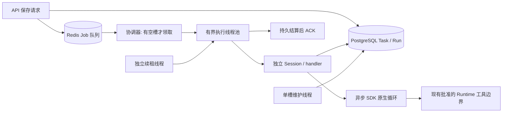

# Worker 并发执行架构

日期：2026-10-09。本文描述本次实现；服务器 Worker 尚未部署重启。

## 执行模型

API 保存 Task/Run 并入队。Worker 协调器只有空闲槽时才领取 Job；默认 concurrency=4，四个 Job 可同时运行，其余留队列。ThreadPoolExecutor 内部不预存额外 Job。

每个 Job 的完整执行由同一个线程承载到持久结算和 ACK。现有服务层使用同步 SQLAlchemy，故采用有界线程消费池，每 Job 独立 Session、handler、身份和日志上下文。线程内调用原有异步 SDK 入口；等待网络不忙等。不同角色共用执行协议，不各建一个池。多个 Worker 可通过原有原子队列领取和 token 租约横向扩容。

Task 是持久业务流程，Run 是一次角色执行，Job 是本次投递，线程和 asyncio Task 是进程内载体。编码、复核、测试、Manager、知识处理的就绪阶段均可并发；依赖、审批和子流程等待使用既有持久恢复机制。

SDK 负责一次 Run 的模型、工具和 handoff 循环。平台负责准入、租约、阶段依赖、审批、取消和结果。消费队列的常驻循环不会周期性重新调用同一个正在执行的 SDK Run。

## 职责和事务

| 组件 | 职责 |
| --- | --- |
| 协调器 | 领取、准入、槽位、Future 收割、Worker 心跳、统计 |
| Job 池 | 最多 N 个完整 Job，各自创建 Session 和 handler |
| 租约监督线程 | 独立续期队列租约和 WorkerLease，不受 SDK 或维护等待影响 |
| Run 锁续期线程 | 每活动 Run 一个等待线程，按 TTL/3 比较 token 续期和释放 |
| 维护执行器 | 单槽恢复和低频维护；不重叠，启动恢复后才准入 |

同步 handler 不改成伪 async，ORM Session 不跨线程传递。续租和结算使用每 Job 的短互斥区，已结算 Job 不再续租，避免 ACK 后的晚到心跳误报失租。

领取事务重新检查 Worker 状态、容量、路由并登记 WorkerLease，再开始执行。SDK Session 读写回调结束提交，释放追加锁；工具回调提交结果；MCP 意图在远端 I/O 前提交。模型等待不持有前一次 Session 追加事务。

单个 Run 的产品工具仍共享该 Job 的同步 Session，所以 OpenAI parallel_tool_calls=False。不同 Run 可并发。以后需要单 Run 内工具并行时，应先拆成每调用独立事务和费用预留；不能并发使用一个 Session。

ExecutionControl 通过 ContextVar 绑定 Job，上下文退出恢复 token；线程间只共享控制信号。模型结果、工具调用、会话提交和 Run 终态边界检查所有权。

## 长任务、取消与恢复

长编码、复核、测试占用一个执行槽直到本次 Job 结束。消费池容量不代替 Run 期限。Run 锁不再固定 600 秒后过期，持有期间持续续期；模型轮数和 Runtime 操作期限继续由现有配置控制。

失租立即设置 ownership_lost，SDK 取消检查器能观察它。旧执行者不得提交模型结果、完成租约、ACK 或重试。Run 留给现有恢复流程核对，不把失租伪装成业务取消，也不保证外部副作用 exactly-once。

SIGINT/SIGTERM 停止领取，并向所有活动 SDK Run 发协作取消信号；停止导致的错误不再重试。Python 线程不能强制终止，不支持协作取消的同步 handler 需等待自身超时或返回。本次没有增加任意强杀线程或 Runtime 的逻辑。管理接口 drain 仍停止领取并等待现有 Job 自然结束。

## 团队推进

team.execution_loop 保持单次状态推进语义。workspace+team 的稳定幂等键合并 queued、processing、retry 投递；移除时间窗口 suffix 参数，没有旧参数兼容映射。

维护查询排除 stopped/paused 团队，跳过已有 queued、running、waiting_approval、waiting_runtime、waiting_subworkflow Run 的 Task。正常执行中的 Run 不因扫描重新驱动。保留低频调度和恢复扫描。

本次未重写为完整事务 Outbox 推进器。处理期间触发被合并，依靠既有完成触发及低频扫描继续推进；不能宣称逐事件可靠消费。

## 配置

运行命令：python -m backend.app.runtime.workers.cli --concurrency 8

--concurrency 表示同时执行槽数，默认 4；--max-jobs 表示本次总处理数量上限，达到后等已领取 Job 结算再退出；--once 处理至多一个 Job。WorkerRunnerConfig 只接受 concurrency，没有旧 max_jobs 配置别名。

WorkerNode 的持久领域容量 capacity.max_jobs 保存执行容量，值来自 concurrency；它不是 RunnerConfig 兼容层。心跳包含 active_jobs、available_slots。多副本必须使用唯一 Worker ID。

数据库、Redis、模型、Runtime 和 MCP 容量要按所有进程合计。共享账号/目录仍遵守原有锁和限制。增加 Worker 槽不等于解除各项资源上限。

## 验证和范围

可控异步 SDK 通过真实 consumer pool 执行持久 AgentRun，无真实模型、订单或业务 MCP 请求。容量 2 下验证两个 Run 实际同时进入 SDK、第三个留队列、独立线程/Session、停止取消，以及失租后不写终态。complete/cancel/lost 三种模式分别通过文件 SQLite 和 PostgreSQL 验证；另验证 Run 锁超过 TTL 仍阻止第二执行者，释放后可再领取。

PostgreSQL 夹具强制在隔离 schema 建表，使用 checkfirst=False，避免 public 表满足建表检查。首次验证前的旧夹具曾误落入 public，写入 3 组测试数据；这些工作空间已归档，测试用户/凭据已禁用，测试 Worker 记录已移除，不可变审计证据予以保留。

已实现：有界线程消费池、独立维护与续租、协作取消、所有权信号、Session/工具事务释放、团队投递合并。未实现：全服务层协程化、SDK Runtime host 重构、事件 Outbox 推进、服务等级保留槽、公平队列、跨地区数据投递和模糊副作用恢复协议。

服务器 Worker 保持停止，本次代码未部署；线上订单与模型不重测。

参考：[Celery 消费池](https://docs.celeryq.dev/en/stable/userguide/concurrency/index.html)、[Celery 预取和长任务](https://docs.celeryq.dev/en/stable/userguide/optimizing.html)、[SQLAlchemy Session 线程边界](https://docs.sqlalchemy.org/en/20/orm/session_basics.html#is-the-session-thread-safe-is-asyncsession-safe-to-share-in-concurrent-tasks)。
